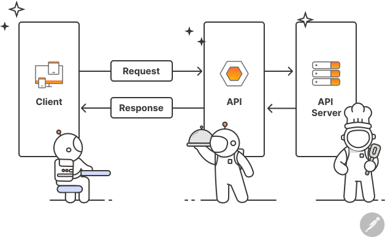

# 3주차 세션 5: JavaScript API 호출

## 📌 세션 개요
- **주제**: API 호출 및 데이터 처리
- **목표**: JavaScript에서 `fetch()`와 `axios`를 활용하여 외부 API 데이터를 가져오는 방법을 익힌다.
- **시간**: 2시간
- **필수 도구**: Code Sandbox, 인터넷 연결

---

## ✅ 지난 세션 과제 확인 (30분)
- change js to ts
- type & class

---

## 1. 오프닝 (10분)
### ✅ 강의 목표
- API의 개념과 역할 이해
- `fetch()`와 `axios`를 사용한 API 호출
- 비동기 프로그래밍과 `Promise` 처리 방법 익히기
- `async/await`을 활용한 비동기 프로그래밍 익히기

### ✅ API란?
- **Application Programming Interface**의 약자로, 한 소프트웨어가 다른 소프트웨어와 소통할 수 있도록 도와주는 규칙과 도구들의 모음.
- API는 프로그램 간 데이터를 주고받을 때 사용됨.
- 클라이언트(사용자)와 서버(데이터 제공자) 간의 통신을 담당함.
- URL을 통해 요청(Request)을 보내고, 서버는 응답(Response) 데이터를 반환함.



---

## 2. API의 종류 (10분)
- **REST API**: 가장 일반적인 API 형태, HTTP 요청(`GET`, `POST`, `PUT`, `DELETE`) 사용
- **SOAP API**: XML 기반의 API로, 은행/기업에서 주로 사용됨
- **GraphQL API**: 원하는 데이터만 요청할 수 있는 API
- **WebSocket**: 실시간 데이터 전송(API 요청 없이 서버에서 데이터 Push 가능) ex. Zoom, chatroom
- **Webhook**: 단방향 Event-driven 실시간 데이터 전송 ex. Stripe, Venmo

---

## 3. JavaScript에서 API 호출 (40분)

### 1. `fetch()`를 이용한 API 호출
```js
fetch('https://jsonplaceholder.typicode.com/todos/1')
    .then(response => response.json())
    .then(data => console.log(data))
    .catch(error => console.error('Error:', error));
```

#### `fetch()` 특징
- 비동기적으로 네트워크 요청을 보내고, 응답을 기다리는 함수.
- `.then()` 체인을 이용하여 응답을 처리함.
- `.catch()`를 사용하여 오류를 처리할 수 있음.
- HTTP 요청이 완료될 때까지 기다리지 않고 다음 코드가 실행됨.

### 2. `axios`를 이용한 API 호출
```js
import axios from 'axios';

axios.get('https://jsonplaceholder.typicode.com/todos/1')
    .then(response => console.log(response.data))
    .catch(error => console.error('Error:', error));
```

#### `axios` 특징
- `Promise` 기반의 HTTP 클라이언트로 `fetch()`보다 편리한 기능 제공
- `fetch()`와 달리 JSON 변환 없이 `response.data`로 바로 접근 가능
- **자동 HTTP 오류 처리** (`fetch()`는 400, 500 에러를 `catch`에서 잡지 않음)
- `timeout` 옵션 설정 가능
- `npm install axios`를 통해 설치 필요

### 3. `async/await`을 이용한 API 호출
- `async/await`은 `Promise` 기반의 비동기 코드를 더 읽기 쉽게 작성하는 방법
- `.then()` 체인보다 직관적인 방식으로 API 요청을 처리할 수 있음
- `await` 키워드는 `Promise`가 완료될 때까지 기다림
- `.then()` 체인보다 가독성이 높고 유지보수에 유리
- `try-catch` 문을 사용해 에러를 쉽게 처리 가능 (try-catch-finally)
- `await`을 통해 순차적으로 코드 실행 가능

#### async/await을 사용한 API 호출
```js
  async function fetchData() {
      try {
          const response = await fetch('https://jsonplaceholder.typicode.com/todos/1');
          // fetch 대신 axios도 사용 가능능
          // const response = await axios.get('https://jsonplaceholder.typicode.com/todos/1');

          if (!response.ok) {
              throw new Error('네트워크 오류 발생');
          }
          const data = await response.json();
          console.log(data);
      } catch (error) {
          console.error('Error:', error);
      }
  }

  fetchData();
```

#### 

---

## 4. 실습: API 데이터 가져오기 (30분)
### 🔹 `fetch()`와 `axios`를 활용하여 랜덤 사용자 데이터를 가져오기
- https://jsonplaceholder.typicode.com/users 엔드포인트를 사용하여 API 데이터를 호출.
- `fetch()`와 `axios` 두 가지 방법으로 동일한 데이터를 가져오고 비교
- 콘솔에 사용자 이름과 이메일을 출력
- 05_js_api_call.ts 참조. js 파일로 실습을 진행해도 좋음.
- https://codesandbox.io/p/sandbox/4rvt5h
---

## 5. 마무리 (20분)
### ✅ 오늘 배운 내용 정리
- API의 개념과 역할
- `fetch()`와 `axios`, `async/await` 활용한 API 호출 방법
- `Promise`와 비동기 코드 처리
- 실습을 통해 API 데이터를 가져와 화면에 출력

### ✅ 과제
- API 호출 실습 과제:
  - https://codesandbox.io/p/sandbox/pfxv59
- Git에 대해서 조사하고 공부해오기. 다음 시간에 짧게 발표, 토의
---